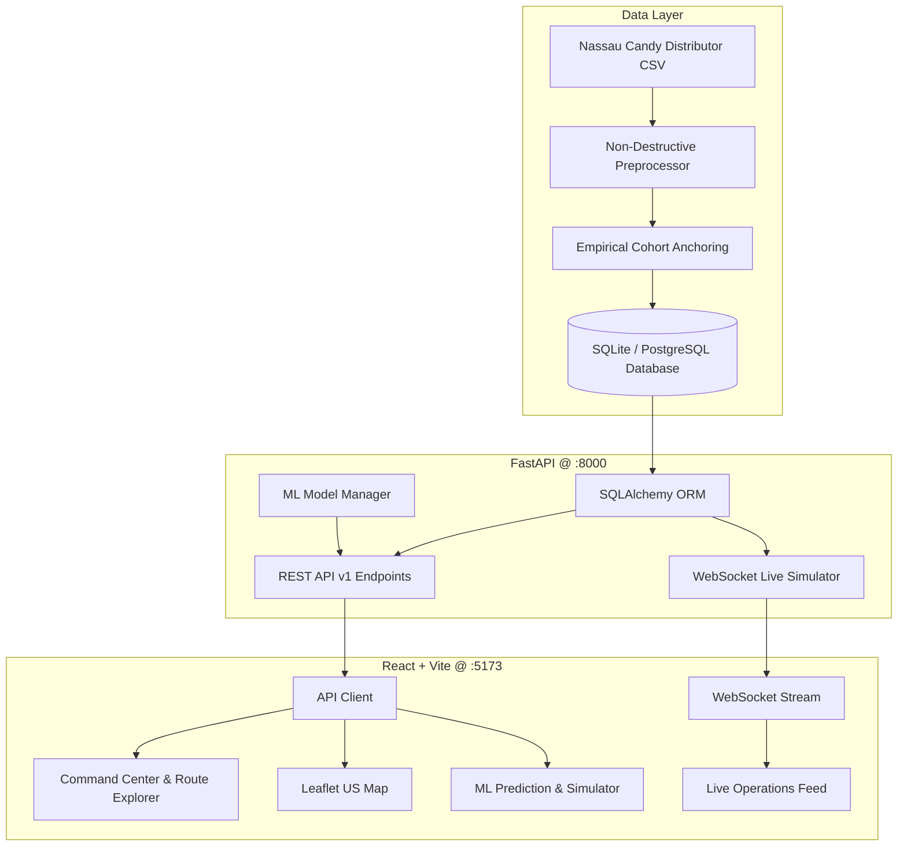

# SmartRoute AI — Intelligent Factory-to-Customer Logistics Analytics & Decision Support System

> **Final-Year Internship Project for Nassau Candy Distributor**  
> Built with **React**, **FastAPI**, **PostgreSQL / SQLite**, **Scikit-Learn**, **Tailwind CSS**, and **Leaflet**.

---

## 🚀 Project Overview

**SmartRoute AI** is an enterprise-grade logistics analytics, prediction, and decision-support platform designed for **Nassau Candy Distributor**. The system transforms raw historical order records into actionable supply chain intelligence across 5 major manufacturing facilities and 196 factory-to-customer state shipping corridors.

### Key Capabilities:
- **Command Center Dashboard:** High-level executive KPI telemetry, delay rates, and network performance.
- **🆕 New Order Management:** End-to-end customer order intake, automated factory assignment, and ML ETA/delay risk scoring.
- **📊 Prediction vs Actual Performance:** Continuous model evaluation (MAE, RMSE, Error Tolerance Accuracy, Confusion Matrix, Precision, Recall, F1).
- **📈 Model Performance Monitoring:** Live drift tracking, version tracking, and performance degradation warnings ($N \ge 5$ quorum).
- **🧪 AI Prediction Playground:** In-memory sandbox to simulate lead times and risk scores without database mutations.
- **⚖️ Route Comparison Engine:** Side-by-side corridor benchmark analyzing lead times, delivery variance ($\sigma$), and efficiency scores.
- **🤖 AI Logistics Assistant:** Conversational analytics query engine translating natural language questions into safe, read-only SQL aggregations.
- **🔔 Notification Center:** Slide-over notification drawer with unread badge counter and multi-domain filtering (Orders, Models, Routes, Anomalies, Quality).
- **⚡ Global Command Palette (`Ctrl + K`):** Instant keyboard-driven search for orders, routes, factories, products, states, and modules.
- **Interactive US Logistics Map:** Geospatial mapping of factories, states, volume nodes, and carrier delay tiers with drilldown analytics.
- **Unsupervised Anomaly Detection:** Isolation Forest isolating multidimensional transit outliers.
- **Shipment Volume Forecasting:** Time-series forecasting projecting 14-day daily dispatches with 95% confidence intervals.
- **What-If Scenario Simulator:** Strategy comparison tool quantifying transit time savings and risk reductions before dispatch.
- **Live Operations (WebSockets):** Real-time event simulator broadcasting simulated logistics telemetries over WebSockets.
- **Executive PDF Report Generator:** Dynamic, publication-quality logistics report generator powered by ReportLab.

---

## 🏛 System Architecture



---

## 📦 Technology Stack

| Layer | Technology | Purpose |
|---|---|---|
| **Frontend** | React 18, Vite, TypeScript | Fast, responsive single-page logistics SaaS dashboard |
| **Styling & UI** | Tailwind CSS, Lucide Icons | Modern dark-slate dashboard theme with responsive cards |
| **Mapping** | Leaflet, CartoDB Dark Matter | Interactive US geospatial rendering of factories and states |
| **Backend API** | FastAPI, Uvicorn, Pydantic | High-performance asynchronous REST API + automatic Swagger docs |
| **Database** | SQLite (Dev) / PostgreSQL (Prod) | Zero-friction local run with full PostgreSQL schema parity |
| **Machine Learning**| Scikit-learn, NumPy, Pandas | Random Forest (Delay/ETA), Isolation Forest (Anomalies) |
| **Real-Time** | WebSockets (`websockets`) | Full-duplex live logistics analytics event simulator |
| **Reporting** | ReportLab | Server-side executive PDF report generation |

---

## 📊 Dataset & Preprocessing Methodology

The source file [`Nassau Candy Distributor.csv`](file:///C:/Users/prana/OneDrive/Desktop/SmartRoute-AI/Nassau%20Candy%20Distributor.csv) contains **10,194 records and 18 columns**.

### The Date Anomaly & Empirical Cohort Anchoring:
Raw dates exhibited an artificial multi-year offset (raw lead times of 904 to 1,642 days). SmartRoute AI resolves this without altering the raw CSV through **empirical Same Day cohort anchoring**:
$$\text{Operational Lead Time} = (\text{Ship Date} - \text{Order Date}) - \min(\text{Same Day Raw Lead Time in Cohort})$$
This restores real-world shipping durations:
- **Same Day:** 0–1 days (mean: 0.38d)
- **First Class:** 1–3 days (mean: 2.55d)
- **Second Class:** 2–5 days (mean: 3.57d)
- **Standard Class:** 4–7 days (mean: 5.32d)

### The 5 Explicit Audit Flags:
1. `flag_artificial_date_shift`: 10,194 records (100.0%)
2. `flag_truncated_us_postal_code`: 449 records (4.4%)
3. `flag_canadian_fsa_postal_code`: 200 records (1.96%)
4. `flag_product_division_inconsistency`: 6 records (0.06%)
5. `flag_extreme_product_volume_imbalance`: 230 records (2.26%)

---

## 🏭 Factory & Product Allocations

| Factory Name | Coordinates | City, State | Specialization |
|---|---|---|---|
| **Lot's O' Nuts** | 32.881893, -111.768036 | Casa Grande, AZ | Nut & Marshmallow Chocolate Bars |
| **Wicked Choccy's** | 32.076176, -81.088371 | Savannah, GA | Premium Milk & Caramel Chocolate |
| **Sugar Shack** | 48.119140, -96.181150 | Thief River Falls, MN | Sugar Candies & Beverages |
| **Secret Factory** | 41.446333, -90.565487 | Rock Island, IL | Experimental Confections |
| **The Other Factory**| 35.117500, -89.971107 | Memphis, TN | Chewy Candies & Toffee |

---

## ⚡ Quick Start & Setup Instructions

### 1. Prerequisites
- Python 3.9+ installed
- Node.js v18+ and npm installed

### 2. Backend Setup
```bash
# Navigate to project root
cd SmartRoute-AI

# Install Python dependencies
pip install fastapi uvicorn sqlalchemy pydantic passlib python-jose[cryptography] websockets python-multipart reportlab scikit-learn pandas numpy

# Initialize database and train models
python src/init_db.py
python src/ml_models.py

# Run FastAPI backend
python -m uvicorn backend.app.main:app --host 0.0.0.0 --port 8000 --reload
```
API Documentation will be available at: [http://localhost:8000/docs](http://localhost:8000/docs)

### 3. Frontend Setup
```bash
# Navigate to frontend directory
cd frontend

# Install npm dependencies
npm install

# Start development server
npm run dev
```
Open your browser at: [http://localhost:5173](http://localhost:5173)

### 4. 1-Click Demo Accounts
| Role | Email | Password | Permissions |
|---|---|---|---|
| **Admin** | `admin@smartroute.ai` | `Admin123!` | Full governance, data management |
| **Analyst** | `analyst@smartroute.ai` | `Analyst123!` | ML models, simulations, forecasting |
| **Manager** | `manager@smartroute.ai` | `Manager123!` | Operations, factory metrics, alerts |
| **Viewer** | `viewer@smartroute.ai` | `Viewer123!` | Read-only analytics & route explorer |

---

## 🧪 Testing

Run the automated test suite:
```bash
python tests/test_smartroute.py
```
*Output: `ALL TESTS PASSED SUCCESSFULLY! (5/5)`*

---

## 📚 Project Documentation
- **Date Anomaly & Operational Lead Time Whitepaper:** [`docs/operational_lead_time.md`](docs/operational_lead_time.md)
